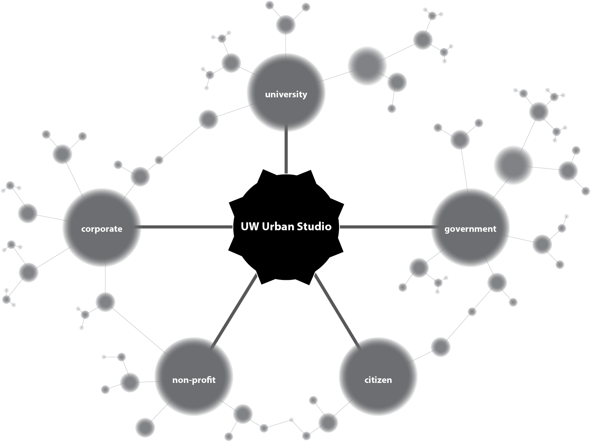
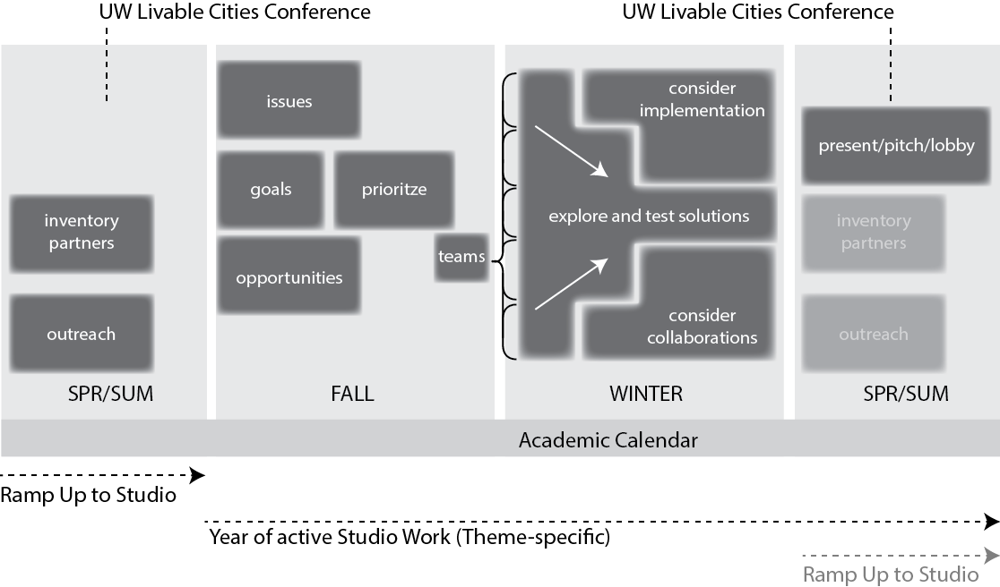
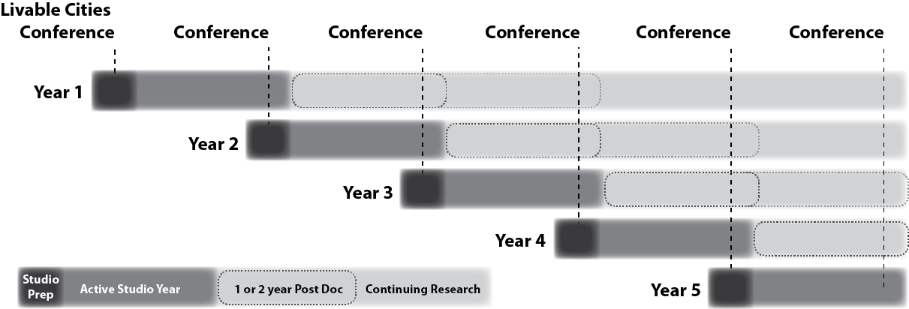
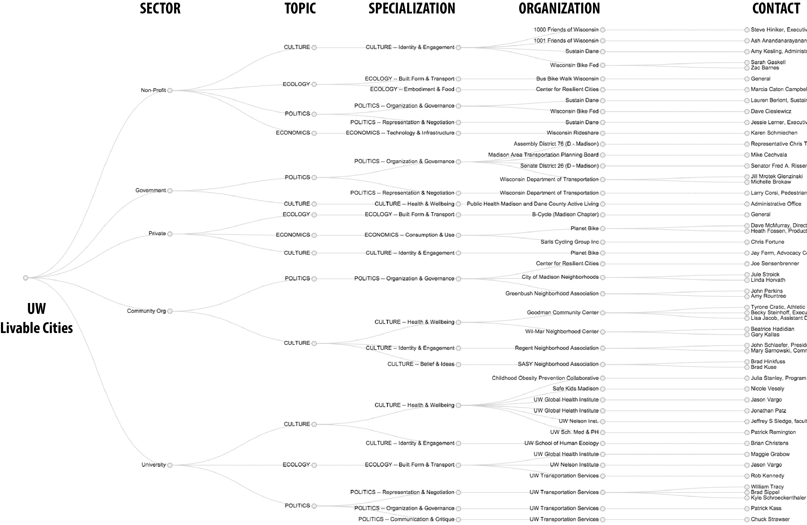

#Livable Cities UW#
For more on Livable Cities read the [initial draft of the Livable Cities Idea](https://github.com/vargovargo/LivableCities/blob/master/LivableCitiesOriginal.md#livable-cities-inspiring-the-university-to-create-future-ready-communities) and the [Introduction of the Studio Concept](https://github.com/vargovargo/LivableCities/blob/master/StudioIntro.md#livable-cities-uw).

- - -

 
##Vision##
Our goal is make the University of Wisconsin an international destination for science, scholarship and outreach to create diverse, safe, just and healthy urban areas. With concepts and prototypes for cleaner air, water, soil and power, and economically, equitably, ecologically and culturally rich urban places, we want to offer practical systems and models that emerging cities around the world can adapt and adopt.

##The UW Urban Studio##
###University Rigor. Real Problems. Better Places. Fuller Lives.###
University of Wisconsin Livable Cities, through its ___Urban Studios___, aims to connect UW experts and students with local governments and communities in the places we live. Our goal is to produce solutions that serve as models for improving lives for people in cities around the world.  

Cities are now the dominant human habitat on Earth. Activities within their administrative boundaries affect places and people far beyond.  Thus urban innovation and solutions are needed to solve problems at the scale of local inequalities and global climate change. Impactful research and meaningful training require universities to work with cities; however, there is currently no good mechanism for directing the incredible faculty and student resources of the UW to study and work on these issues.  ___UW's Urban Studio___ will be a physical University space in the City of Madison where the _sectors_ of urban life convene. The Studio is both a forum for stakeholders to collectively define urban issues and an incubator for creating solutions.

The five sectors and their expected outcomes are:

>__Citizen__ _improved quality of life, health, opportunity, security_

>__Corporate__ _discovery of new products, services, and markets_

>__Government__ _improved policies and partnerships with citizens and businesses_

>__Service (non-profit)__ _improved tools and designs for new programs and partnering communities_

>__University__ _new research frontiers and collaborations on and off campus_

- - -

##Project Plan##
To foster the collaborations needed for urban innovation and success, Studios are designed to focus attention on specific issues around where UW has momentum. Importantly, however, the 5 year plan for Studios includes rolling out new themes in Studios. This helps ensure that the connections between urban systems investigated in any one Studio are considered within the context of academic research.

The Urban Studio will be conducted on annual basis with changing themes determined by the UW Livable Cities Coordinating Council. Each year the studio would concentrate on a theme of urban activity. Already, several themes have been identified for the first five (_5_) years of operation.

+ [Local Motion -- Active Transport in Cities](StudioIntro.md#local-motion--active-transport-in-cities)
+ [Weather Ready Cities](StudioIntro.md#weather-ready-cities)
+ [Feeding the City](StudioIntro.md#feeding-the-city)
+ [Energy Independent Cities](StudioIntro.md#energy-independent-cities)
+ TBD

In addition to the Studios, each year a conference will be held in Madison, WI on urban issues and research. The conference serves three purposes

1. Introduces the studio theme for the coming year and engages the participating parties from the 5 sectors.
2. Connects the results and progress from the previous Studio's work to new Studios and the public through presentation and discussion. 
3. Increases the visibility of UW and the City of Madison in the arena of urban sustainability research and practice.

Particularly in the year proceeding the first Studio, the conference will be used to inform colleagues on the UW-Madison, and other UW Campuses about activities and opportunities with Livable Cities. This will increase the participation among UW faculty and bring new topics and research to the Urban Studio. Conferences in later years (3-5), will take advantage of previous Studio work and subsequent research, to attract wider audiences and higher impact speakers. 

- - -

##Activities / Operations##

The Studio will serve as a space for hosting stakeholders, fostering discussion, prototyping designs and solutions, and presenting ideas to the public. Each Theme will inhabit the Urban Studio space for approximately one year, however, activities and partnerships formed through that work are expected to continue beyond the first year. Annually, a new network of related UW faculty and non-University partner organizations will be assembled based on the Studio Theme. Associated faculty will receive 20% time buy out for participation and be expected to work out of the Studio space part time during that year. Student recruitment for Studio participation is still a hurdle as it takes coordination at the University level to receive credit.  To begin, Studios will be offered as an internship possibility. The operation of the Urban Studio will be handled by a new administrative manager, and staffed by two (_2_) student hourlies/term. Additionally, following each Theme (ie each year) faculty members of the Studio will recruit a post-doc to be hired.

The five year plan for the Studios builds in the requirement of Studio work to spur collaborative research on campus, and explore connections across urban themes. This is accomplished by hiring post-doctoral scholars following each year of the Studio's operation. This strategy also encourages the pursuit of external funding for Studio-driven research, with the aim of achieving a self-sustaining level of funding, or attracting complimentary funding, in the 5-10 year range. 

- - -

We anticipate an annual of budget of approximately $250-300,000 to operate the Urban Studio in the first five years. Money would go toward:

+  A new administrative manager dedicated to the operation and coordination of the Studio + fringe (_$70-$80K/yr_)
+  Rented space for the Studio, approximately 3,000 sq ft. in Downtown Madison to facilitate maximum collaboration with the city (_$36K - $60K/yr_)
+  Two student hourlies for ~12hr/wk (_$15K/yr_)
+  Meeting Costs (_$30K/yr_)
+  Buy out (5) faculty time @ 10% + fringe (_$120K_)
+  1 yr Post doc + fringe (_$65K_)

- - - 

##Active Transportation Studio Ramp-up Activities##

We have begun to assemble a network of potential partners that might be involved in Year 1 of the Urban Studio - focused on Active Transportation. These include partners from all 5 sectors [described above](#the-uw-urban-studio).

